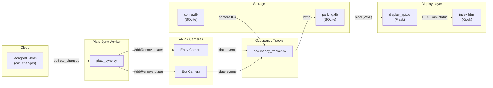

# System Architecture

## Overview

The Smart Parking System uses Honeywell ANPR (Automatic Number Plate Recognition) cameras to track vehicle entry and exit, maintaining a real-time count of occupied parking slots displayed on a kiosk screen.

## Data Flow

## Component Responsibilities

### plate_sync.py (MongoDB → Camera Sync)
- Watches MongoDB `car_changes` collection for new add/delete plate requests
- Pushes changes to the ANPR camera's plate allowlist via HTTPS
- Removes processed records from MongoDB
- Handles retries with exponential backoff and poison-message detection

### occupancy_tracker.py (Camera → SQLite)
- Polls entry and exit cameras for plate detection events
- Maintains `cars_inside` table in `parking.db`
- Entry: adds allowed cars to the store
- Exit: removes cars from the store

### display_api.py (SQLite → REST API)
- Read-only Flask API that reads `parking.db`
- Exposes `/api/status`, `/api/recent`, `/api/health`
- Used by the kiosk display frontend

### jetson_server.py (Alternative Backend)
- Standalone Flask backend for Jetson deployments
- Manages its own `vehicles` table (different schema from occupancy tracker)
- Accepts plate push notifications via POST endpoints

### index.html (Kiosk Display)
- Full-screen parking status display
- Polls the display API every 3 seconds
- Shows occupancy grid, stats, and recent activity
- Falls back to demo data when backend is unreachable

## Database Schemas

### parking.db — `cars_inside` (used by occupancy_tracker + display_api)
| Column   | Type    | Description                    |
|----------|---------|--------------------------------|
| snap_id  | TEXT PK | Plate/snap identifier          |
| grp_id   | INTEGER | Group: 1=allowed, 2=blocked    |
| entered  | TEXT    | ISO timestamp of entry         |

### config.db — `cameras` (used by occupancy_tracker)
| Column | Type    | Description                |
|--------|---------|----------------------------|
| role   | TEXT PK | 'entry' or 'exit'          |
| ip     | TEXT    | Camera IP address          |

### MongoDB — `car_changes` (used by plate_sync)
| Field       | Type   | Description                    |
|-------------|--------|--------------------------------|
| car number  | String | License plate number           |
| action      | String | 'add' or 'delete'              |
| retryCount  | Number | Number of failed attempts      |
| failed      | Bool   | True if permanently failed     |
